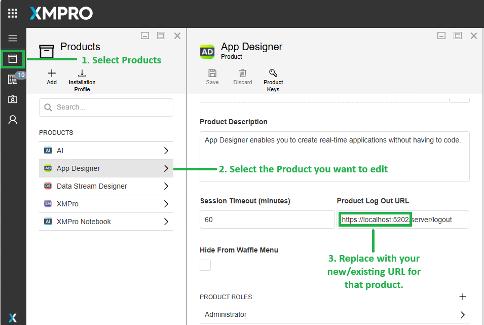
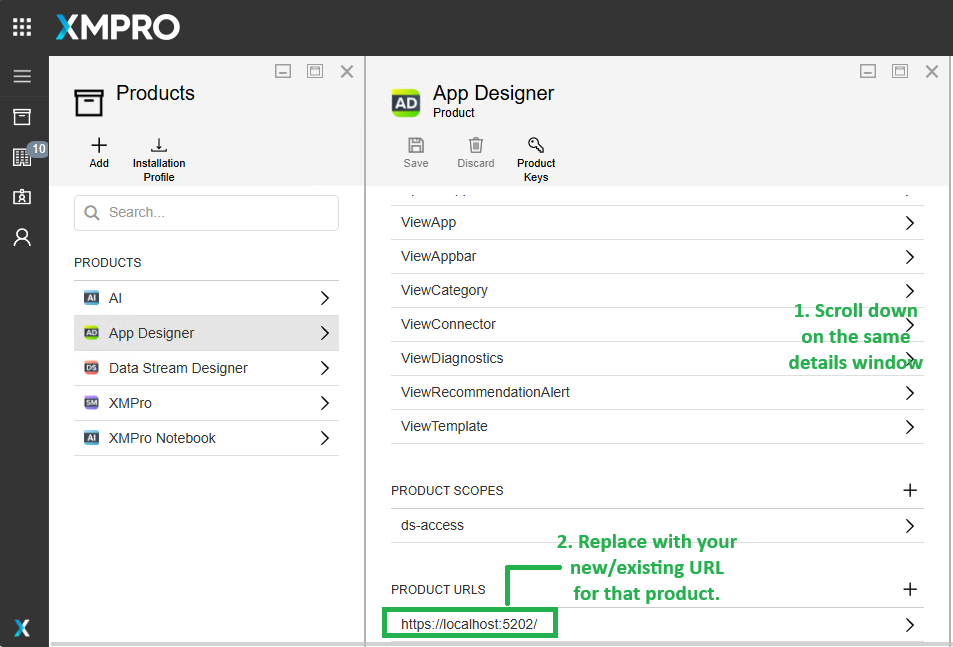

# Upgrade from Legacy Windows Installer

If you're currently running XMPro v4.4.x using the legacy Windows installer and planning to upgrade to v4.5/Latest, this guide provides important considerations and step-by-step instructions for a smooth migration.

The latest version introduces a modernized Windows installer that significantly simplifies the deployment process while maintaining compatibility with your existing data and configurations.

> [!IMPORTANT]
> Version 4.5/latest is primarily an **installation method upgrade**. Your existing data, users, and configurations are fully preserved:
>
> - All database data remains unchanged (users, roles, applications, data streams)
> - User credentials and authentication continue to work
> - Existing applications and data streams function without modification
> - APIs and integrations remain compatible
> - Application URLs and ports can remain the same

---

## Required Information from Your Existing Installation

Before running the Windows installer upgrade, document these values from your current v4.4.x installation. You will need them when responding to the installer prompts:

### 1. Product Selection

Note which XMPro components are currently installed:

| Installer Prompt | What to Check | Example |
| --- | --- | --- |
| **Install SM? (y/n)** | Is Subscription Manager currently installed? | Check for `C:\inetpub\wwwroot\XMPro-SM` or similar |
| **Install AD? (y/n)** | Is App Designer currently installed? | Check for `C:\inetpub\wwwroot\XMPro-AD` or similar |
| **Install DS? (y/n)** | Is Data Stream Designer currently installed? | Check for `C:\inetpub\wwwroot\XMPro-DS` or similar |
| **Install SH? (y/n)** | Is Stream Host currently installed? | Check Windows Services for Stream Host service |

> [!TIP]
> Answer **"y" (yes)** to install/upgrade all components that are currently installed in your v4.4.x environment.

### 2. Database Configuration

Gather these values from your current v4.4.x `appsettings.json` files (AD, DS, SH) or `web.config` (SM):

| Installer Prompt | Where to Find | Example |
| --- | --- | --- |
| **Database Server** | SM connection string: `Server=` value | `localhost`, `sql-server.company.com`, or `hostname,1433` |
| **Database Username** | SM connection string: `User Id=` value | `xmadmin` or your current SQL user |
| **Database Password** | SM connection string: `Password=` value | Your current SQL password |
| **Database Protocol** | SM connection string: connection prefix | `tcp` (most common) or `np` (named pipes) |
| **Trust SQL Server Certificate** | SM connection string: `TrustServerCertificate=` | `Y` if currently `true`, `N` if currently `false` or absent |
| **SM Database Name** | SM connection string: `Database=` value | `SM` or your current SM database name |
| **AD Database Name** | AD connection string: `Database=` value | `AD` or your current AD database name |
| **DS Database Name** | DS connection string: `Database=` value | `DS` or your current DS database name |

**Finding connection strings in v4.4.x:**

```powershell
# Example locations (adjust paths to match your installation)
# SM connection string (in web.config):
notepad C:\inetpub\wwwroot\XMPro-SM\web.config

# AD connection string:
notepad C:\inetpub\wwwroot\XMPro-AD\appsettings.json

# DS connection string:
notepad C:\inetpub\wwwroot\XMPro-DS\appsettings.json
```

> [!IMPORTANT]
> **Use the exact same database names** from your v4.4.x installation. The installer will detect these existing databases and perform migration automatically.

### 3. Company and Admin Details (SM Only)

If upgrading Subscription Manager, these values already exist in your database and will be preserved. However, the installer may prompt for them:

| Installer Prompt | What to Provide | Notes |
| --- | --- | --- |
| **Company Name** | Your existing company name | This already exists in your SM database |
| **Company Admin First Name** | Your current admin's first name | Existing user will be preserved |
| **Company Admin Last Name** | Your current admin's last name | Existing user will be preserved |
| **Company Admin Email** | Your current admin's email | Existing user will be preserved |
| **Company Admin Password** | Choose a new password or use existing | You can update the password during upgrade |
| **Site Admin Password** | Choose a new password or use existing | For `admin@xmpro.onxmpro.com` account |

> [!NOTE]
> During upgrade, existing user accounts are preserved. The installer may prompt for admin passwords to ensure you have access after the upgrade.

### 4. Product Configuration

Note these values from your current IIS configuration and application URLs:

| Installer Prompt | Where to Find | Example |
| --- | --- | --- |
| **SM Hostname** | How users access SM | `xmpro.company.com` or `localhost` |
| **SM Listen Port** | IIS site binding port for SM | `5201` (check IIS Manager) |
| **SM Internal Base URL** | If using reverse proxy | Usually same as `https://hostname:port` |
| **AD Hostname** | How users access AD | `xmpro.company.com` or `localhost` |
| **AD Listen Port** | IIS site binding port for AD | `5202` (check IIS Manager) |
| **AD Internal Base URL** | If using reverse proxy | Usually same as `https://hostname:port` |
| **DS Hostname** | How users access DS | `xmpro.company.com` or `localhost` |
| **DS Listen Port** | IIS site binding port for DS | `5203` (check IIS Manager) |
| **DS Internal Base URL** | If using reverse proxy | Usually same as `https://hostname:port` |

**Finding IIS port bindings:**

```powershell
# Open IIS Manager and check site bindings
# Or use PowerShell:
Import-Module WebAdministration
Get-WebBinding -Name "XMPro-SM"
Get-WebBinding -Name "XMPro-AD"
Get-WebBinding -Name "XMPro-DS"
```

> [!TIP]
> **Keep the same ports** to avoid updating bookmarks and integrations. Users can continue accessing XMPro at the same URLs after upgrade.

### 5. SSL Certificates

Locate your current SSL and signing certificates:

| Installer Prompt | Where to Find | Notes |
| --- | --- | --- |
| **SM SSL Certificate Path** | Location of SM HTTPS certificate | Usually `.pfx` file, note the full path |
| **SM SSL Certificate Password** | Certificate password | Required to install certificate |
| **Token Certificate Path** | JWT signing certificate location | Same certificate used in v4.4.x |
| **Token Certificate Password** | Signing certificate password | Required to install certificate |
| **AD SSL Certificate Path** | Location of AD HTTPS certificate | May be same as SM certificate |
| **AD SSL Certificate Password** | Certificate password | Required to install certificate |
| **DS SSL Certificate Path** | Location of DS HTTPS certificate | May be same as SM certificate |
| **DS SSL Certificate Password** | Certificate password | Required to install certificate |

> [!IMPORTANT]
> **Use the same certificates** from your v4.4.x installation to maintain trust and avoid certificate warnings for existing users.

### 6. Stream Host Configuration (if installed)

If Stream Host is installed, note these values:

| Installer Prompt | Where to Find | Example |
| --- | --- | --- |
| **Stream Host Install Path** | Current Stream Host directory | Check Windows Service properties for executable path |
| **Device Name** | Name in Data Stream Designer | Check DS → Stream Hosts section |
| **Data Stream Designer URL** | URL Stream Host connects to | Check Stream Host configuration file |

**Finding Stream Host details:**

```powershell
# Find Stream Host service
Get-Service | Where-Object {$_.DisplayName -like "_Stream_Host*"}

# Check service executable path
$service = Get-WmiObject -Class Win32_Service -Filter "Name LIKE '%StreamHost%'"
$service.PathName
```

---

## Backup Before Upgrading

> [!CAUTION]
> **Always backup before upgrading.** While the installer performs migrations safely, backups ensure you can recover if needed.

**Minimum required backups:**

### 1. SQL Server Databases

```sql
-- Back up all XMPro databases
BACKUP DATABASE [SM] TO DISK = 'C:\Backups\SM_PreUpgrade_v4.4.x.bak'
BACKUP DATABASE [AD] TO DISK = 'C:\Backups\AD_PreUpgrade_v4.4.x.bak'
BACKUP DATABASE [DS] TO DISK = 'C:\Backups\DS_PreUpgrade_v4.4.x.bak'
```

### 2. Configuration Files

```powershell
# Back up current appsettings.json files
New-Item -ItemType Directory -Force -Path "C:\Backups\XMPro_v4.4.x_Config"
Copy-Item "C:\inetpub\wwwroot\XMPro-SM\appsettings.json" -Destination "C:\Backups\XMPro_v4.4.x_Config\" -ErrorAction SilentlyContinue
Copy-Item "C:\inetpub\wwwroot\XMPro-AD\appsettings.json" -Destination "C:\Backups\XMPro_v4.4.x_Config\" -ErrorAction SilentlyContinue
Copy-Item "C:\inetpub\wwwroot\XMPro-DS\appsettings.json" -Destination "C:\Backups\XMPro_v4.4.x_Config\" -ErrorAction SilentlyContinue
```

### 3. IIS Configuration

```powershell
# Export IIS configuration
%windir%\system32\inetsrv\appcmd.exe add backup "XMPro_v4.4.x_Backup"
```

---

## Running the Upgrade

Once you've documented all the required information above:

1. **Stop existing XMPro services** (optional but recommended):

   ```powershell
   # Stop IIS sites
   Stop-WebSite "XMPro-SM" -ErrorAction SilentlyContinue
   Stop-WebSite "XMPro-AD" -ErrorAction SilentlyContinue
   Stop-WebSite "XMPro-DS" -ErrorAction SilentlyContinue

   # Stop Stream Host service
   Get-Service | Where-Object {$_.DisplayName -like "_Stream_Host*"} | Stop-Service
   ```

2. **Run the v4.5 installer** following the [Quick Deployment](index.md#quick-deployment) steps in the Windows Server 2022 deployment guide

3. **Provide your documented values** when prompted by the installer

4. **The installer will automatically**:
   - Detect your existing databases
   - Perform necessary schema migrations
   - Deploy updated application files to IIS
   - Preserve all existing data, users, and configurations
   - Configure the new centralized configuration structure in `C:\XMPro\`

5. **Update product URLs in Subscription Manager** (only if App Designer or Data Stream Designer URLs changed):

   > [!IMPORTANT]
   > If you changed the hostname or port for App Designer or Data Stream Designer during the upgrade, you must update the product URLs in Subscription Manager to ensure proper authentication and navigation.

   **To update product URLs:**

   a. **Log in to Subscription Manager** as site admin or company admin

   b. **Navigate to Products**:
      - Click the menu icon (☰) in the top-left
      - Select "Products" from the left navigation menu

   c. **Select the product to update** (App Designer or Data Stream Designer):

      

      - Click on the product name (e.g., "App Designer")
      - In the product details panel:
        - Update **Product Log Out URL** to match your new URL
        - Example: Change `https://localhost:5202/server/logout` to `https://new-hostname:5202/server/logout`

   d. **Scroll down and update Product URLs**:

      

      - In the **PRODUCT URLS** section at the bottom
      - Update the URL to match your new hostname/port
      - Example: Change `https://localhost:5202/` to `https://new-hostname:5202/`

   e. **Save the changes**:
      - Click the "Save" button at the top of the product details panel

   f. **Repeat for Data Stream Designer** if its URL also changed

   > [!NOTE]
   > If you kept the same hostnames and ports during upgrade, you can skip this step. Product URLs only need to be updated when the access URLs change.

---

## Post-Upgrade Validation

After the upgrade completes, validate your installation:

1. **Verify IIS sites are running**

   ```powershell
   Get-Website | Where-Object {$_.Name -like "_XMPro_"}
   ```

2. **Test login** with your existing credentials at:
   - Subscription Manager: `https://your-hostname:5201` (or your configured port)
   - App Designer: `https://your-hostname:5202` (or your configured port)
   - Data Stream Designer: `https://your-hostname:5203` (or your configured port)

3. **Check health endpoints** to verify products can connect to each other:
   - Subscription Manager: `https://your-hostname:5201/health-ui`
   - App Designer: `https://your-hostname:5202/health-ui`
   - Data Stream Designer: `https://your-hostname:5203/health-ui`

4. **Verify Stream Host connectivity** (if applicable):
   - Check Stream Host service is running
   - Verify Stream Host appears online in Data Stream Designer

5. **Test existing functionality**:
   - Open existing applications in App Designer
   - Verify existing data streams in Data Stream Designer
   - Confirm user access and permissions work correctly

---

## Rollback (if needed)

If you encounter issues and need to rollback:

1. **Stop XMPro services**

   ```powershell
   Stop-WebSite "XMPro-SM" -ErrorAction SilentlyContinue
   Stop-WebSite "XMPro-AD" -ErrorAction SilentlyContinue
   Stop-WebSite "XMPro-DS" -ErrorAction SilentlyContinue
   Get-Service | Where-Object {$_.DisplayName -like "_Stream_Host*"} | Stop-Service
   ```

2. **Restore databases** from your backups

   ```sql
   -- Restore databases
   RESTORE DATABASE [SM] FROM DISK = 'C:\Backups\SM_PreUpgrade_v4.4.x.bak' WITH REPLACE
   RESTORE DATABASE [AD] FROM DISK = 'C:\Backups\AD_PreUpgrade_v4.4.x.bak' WITH REPLACE
   RESTORE DATABASE [DS] FROM DISK = 'C:\Backups\DS_PreUpgrade_v4.4.x.bak' WITH REPLACE
   ```

3. **Restore IIS configuration**

   ```powershell
   %windir%\system32\inetsrv\appcmd.exe restore backup "XMPro_v4.4.x_Backup"
   ```

4. **Restore configuration files** from your backup directory

   ```powershell
   Copy-Item "C:\Backups\XMPro_v4.4.x_Config\*" -Destination "C:\inetpub\wwwroot\" -Recurse -Force
   ```

5. **Restart services**

   ```powershell
   Start-WebSite "XMPro-SM"
   Start-WebSite "XMPro-AD"
   Start-WebSite "XMPro-DS"
   Get-Service | Where-Object {$_.DisplayName -like "_Stream_Host*"} | Start-Service
   ```

> [!CAUTION]
> **Rollback Considerations:**
>
> - Database rollback will lose any data created after the backup
> - Ensure all users are logged out before rolling back
> - Test rollback procedures in a non-production environment first
> - Document the issue before rolling back for troubleshooting purposes

> [!TIP]
> **Need assistance?** Contact XMPro Support or your Implementation Partner for help with the upgrade or rollback process.
