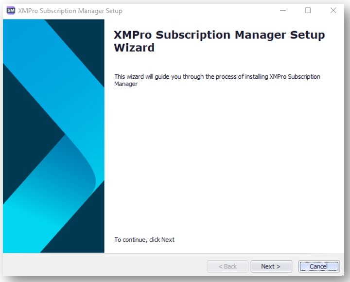
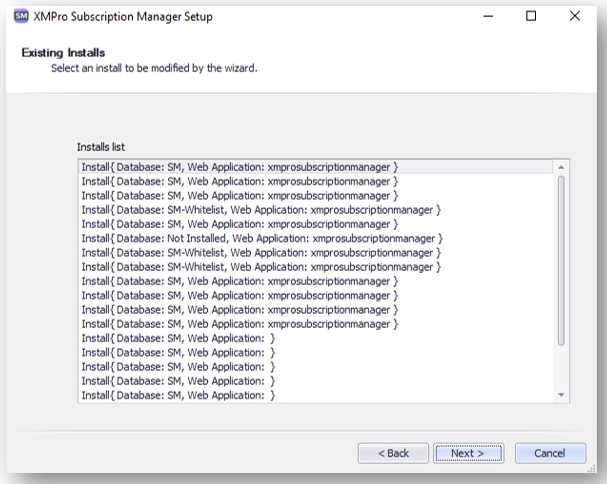
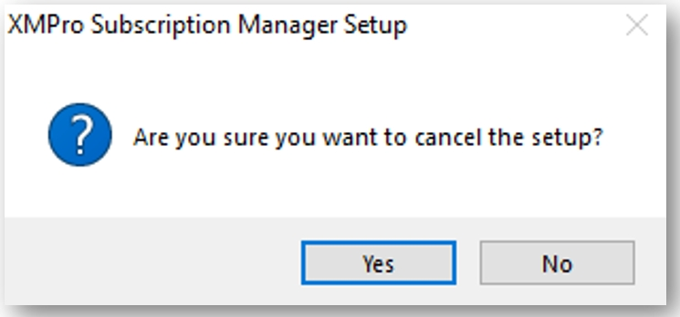
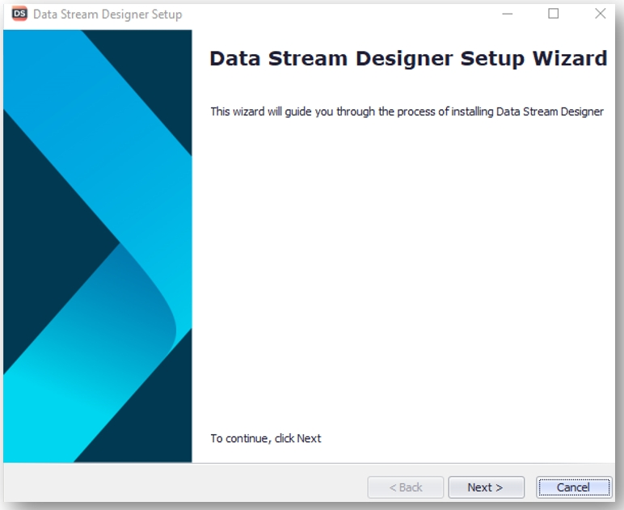
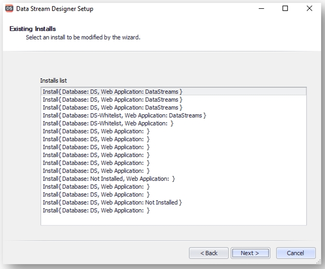
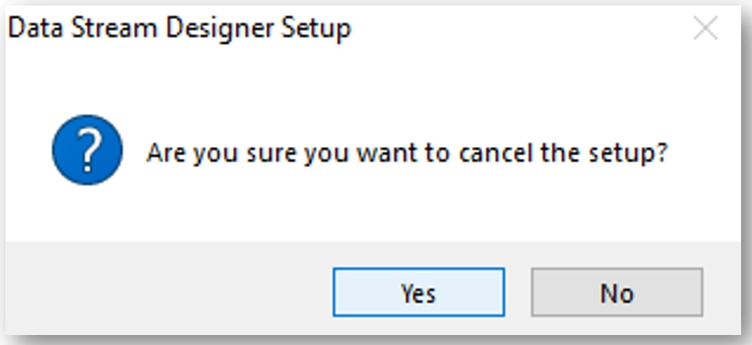
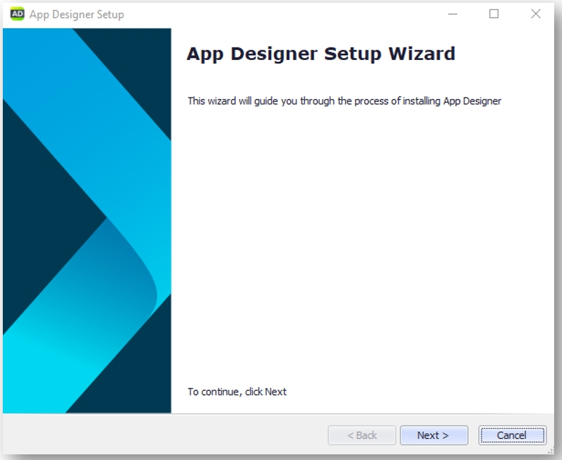
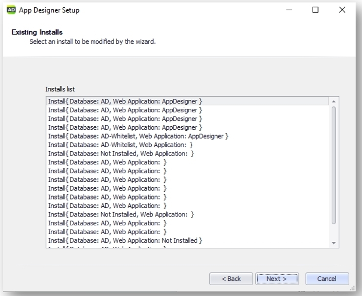
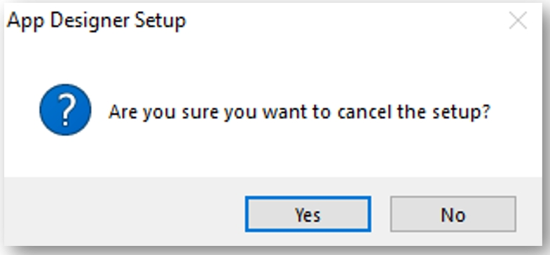

# Upgrade

It is necessary to first uninstall the installers on the host server before proceeding with the upgrade installers. Once you have removed the installers, the procedure for the upgrade is the same as the original install.

This section aims to provide step-by-step instructions on how to safely uninstall only the XMPro installers and not the on-premises deployed XMPro solution.

The process of uninstalling the XMPro installer must be repeated for each application individually. The steps are the same for each application installer and the sequence is not significant.

## Subscription Manager

### Uninstall Subscription Manager Installer

1. Log on to the instance where the XMPro installers are installed.
2. From the start menu select XMPro Subscription Manager and right-click it.
3. Click Uninstall.
4. Select XMPro Subscription Manager from the list of programs displayed.
5. Click Uninstall.
6. When prompted to confirm uninstall click Yes.
7. Click Next.

1. When prompted to select the install to modify click Cancel.
   **We do not want to remove the installed XMPro site, only the installer.**

1. Click on Yes to cancel the setup.

## Data Stream Designer

### Uninstall Data Stream Designer Installer

1. Log on to the instance where the XMPro installers are installed.
2. From the start menu select XMPro Data Stream Designer and right-click it.
3. Click Uninstall.
4. Select XMPro Data Stream Designer from the list of programs displayed.
5. Click Uninstall.
6. When prompted to confirm uninstall click Yes.
7. Click Next.

1. When prompted to select the install to modify click Cancel.
   **We do not want to remove the installed XMPro site, only the installer.**

1. Click on Yes to cancel the setup.

## App Designer

### Uninstall Application Designer Installer

1. Log on to the instance where the XMPro installers are installed.
2. From the start menu select XMPro Application Designer and right-click it.
3. Click Uninstall.
4. Select XMPro Application Designer from the list of programs displayed.
5. Click Uninstall.
6. When prompted to confirm uninstall click Yes.
7. Click Next.

1. When prompted to select the install to modify click Cancel.
   **We do not want to remove the installed XMPro site, only the installer.**

1. Click on Yes to cancel the setup.

You have now successfully uninstalled the XMPro installers. You can proceed to the instructions by navigating to [Installing XMPro](install.md) and perform an upgrade with the new installers.

> [!WARNING]
> Make sure to select the Upgrade option on the installers when proceeding.
