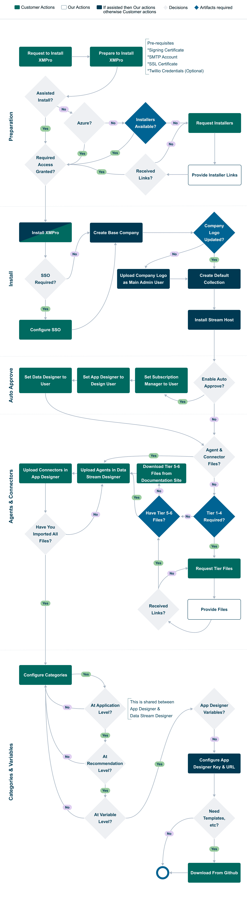

# Overview

XMPro Platform consists of three main components:

* App Designer
* Data Stream Designer
* Subscription Manager

XMPro supports a wide range of deployment options e.g. Cloud, Docker, On-Premise, etc. The complete process - encompassing preparation, installation, setup, and loading templates - is depicted in the flowchart below.

## Artifacts

* [Request Installers](mailto:support@xmpro.com?subject=Request-Installers)
* [Request Tiers 1 - 4](mailto:support@xmpro.com?subject=Request-Tiers-1-to-4)
* [Download and install Tier 5 & 6 Files](complete-installation/install-connectors.md)
  _ Links for the larger AI & ML Agents\_ are on their individual documentation pages, as indicated [here](https://xmpro.gitbook.io/integrations#tier-5).
* [Download GitHub Templates](https://github.com/XMPro/Blueprints-Accelerators-Patterns)
